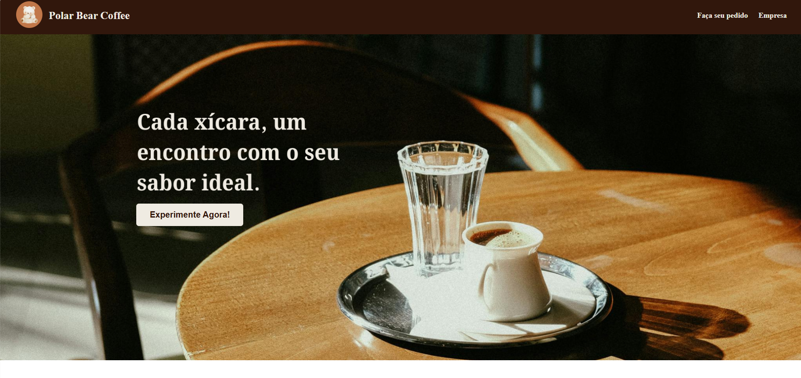
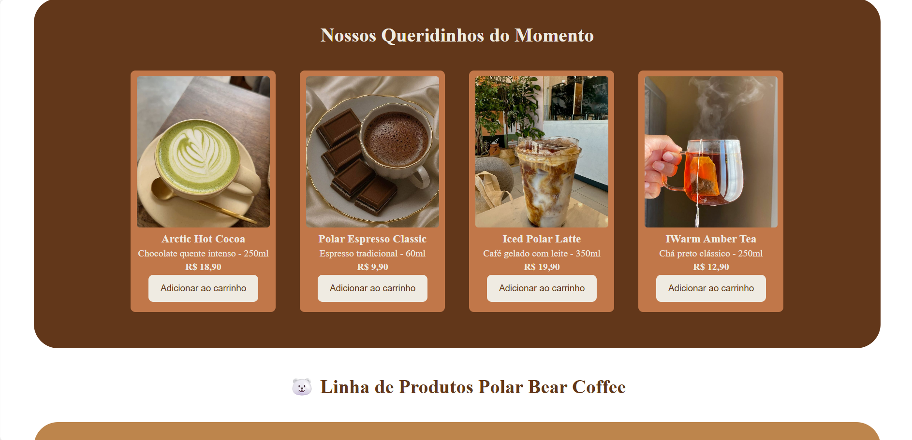
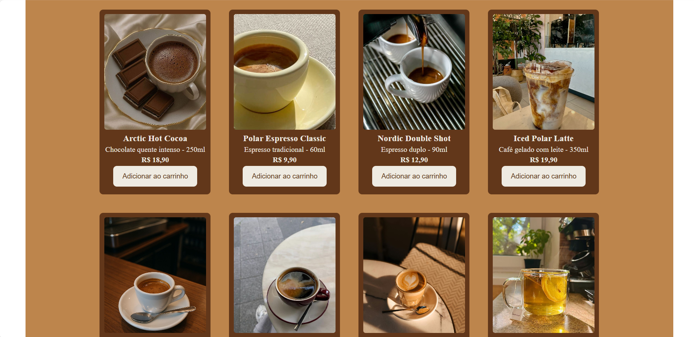
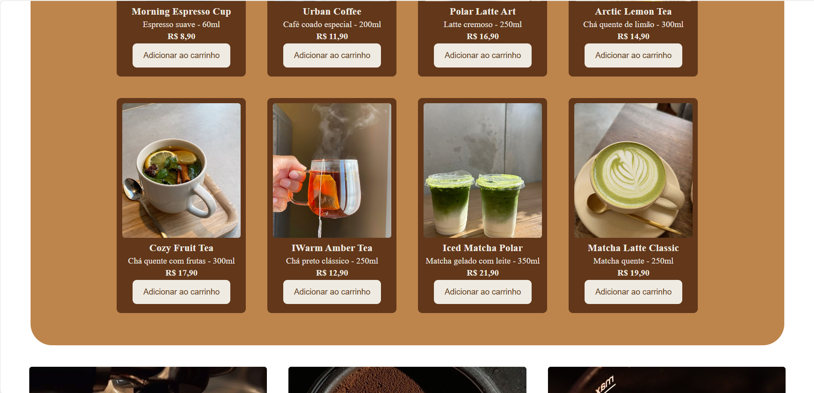
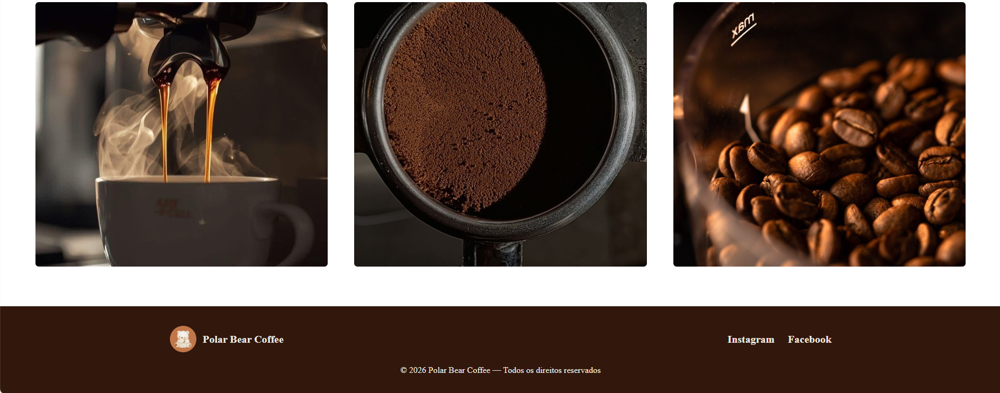
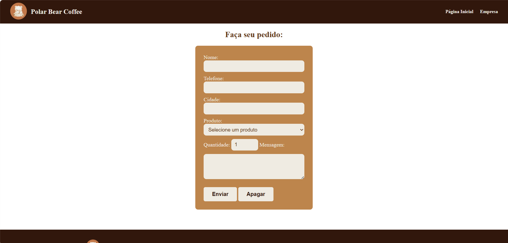

# Polar Bear Coffee | Projeto de Site de Cafeteria

Este é um projeto de site para uma **cafeteria fictícia chamada “Polar Bear Coffee”** — criado como parte do meu portfólio.
Sendo utilizado apenas HTML e CSS.
O objetivo do projeto é apresentar um **cardápio digital de cafeteria** com um layout simples e moderno, permitindo que os usuários visualizem bebidas, promoções e informações da cafeteria de forma clara e agradável.

---

## 🌐 Demo

Acesse o site online:

🔗 https://giovaleriano.github.io/cafeteria

---

## ✨ Sobre o Projeto

O objetivo desse site é demonstrar habilidades de:

- Estruturação de páginas com HTML semântico  
- Design visual com CSS  
- Navegação simples e intuitiva  
- Simulação de um cardápio digital 
- Projeto preparado para portfólio

---

## 📌 Tecnologias Utilizadas

- **HTML5** — Estrutura de páginas web
- **CSS3** — Estilização visual
- Layout adaptado para facilitar leitura e reutilização

---

## 🚀 Funcionalidades

- Exibição do cardápio de cafés e bebidas  
- Layout responsivo  
- Interface simples e moderna  
- Seção com informações da cafeteria  

---

## 📷 Visual
### Início

### Espaço do Cliente

### Saúde & Bem-Estar
![Empresa(img/empresa.png)

---

## 📄 Licença

Projeto criado para fins de estudo e portfólio.

---

## ✉️ Contato

Desenvolvido por **Giovana Valeriano**  
📧 giovvaleriano@gmail.com  
📍 Minas Gerais, Brazil

---

Obrigado por visitar o projeto! 😄

Este projeto foi desenvolvido com foco em aprendizado e prática.

Sugestões e contribuições são sempre bem-vindas. ⭐🚀
